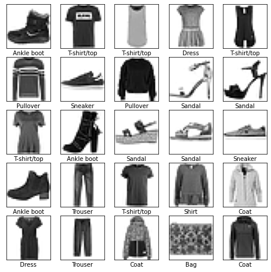
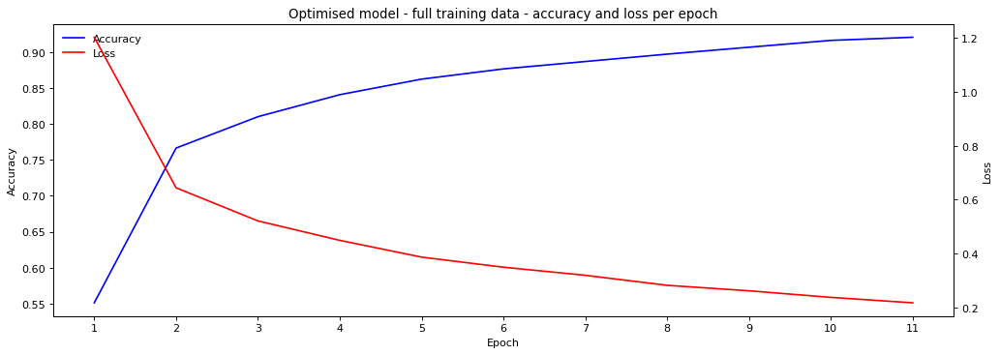

## Classifying items of fashion into categories

<table style="width: 100%;">
  <tr>
    <td style="width: 50%; text-align: center;">
      <figure>
        
      </figure>
    </td>
    <td style="width: 50%; text-align: center;">
      <figure>
        
      </figure>
    </td>
  </tr>
  <tr>
    <th style="width: 50%; text-align: center;">Examples of fashion images data</th>
    <th style="width: 50%; text-align: center;">Final model accuracy & loss by epoch</th>
  </tr>
</table>

### Project objectives

- Build a deep learning convnet model from scratch with tensorflow to classify images of fashion items into categories using the keras Fashion MNIST dataset. It comprises the following 10 categories:

  <table border="0">
    <tr>
      <td>1. Ankle boots</td>
      <td>6. Sandals</td>
    </tr>
    <tr>
      <td>2. Bags</td>
      <td>7. Shirts</td>
    </tr>
    <tr>
      <td>3. Coats</td>
      <td>8. Sneakers</td>
    </tr>
    <tr>
      <td>4. Dresses</td>
      <td>9. T-shirts/tops</td>
    </tr>
    <tr>
      <td>5. Pullovers</td>
      <td>10. Trousers</td>
    </tr>
  </table>

- Use a best practice process of building a model which generalises as best as possible to new data by minimising under- and over-fitting and has an architecture which is neither under- or over-capacity
- The model should have significant power in terms of beating the accuracy performance of the following baseline models:
    - random classifier - 10% (as the data is balanced)
    - basic fully connected dense neural network

  and be comparable to results of published models

- Compare the model's performance with that of a model built using the pretrained VGG16 convnet

### Data and pretrained models used

- Training data comprises 8,000 28 x 28 arrays representing grayscale images where each value in an array is a grayscale number, and 8,000 1D arrays of fashion category labels for each image. Validation data used for hyperparameter tuning and test data used for model evaluation both comprise 2,000 randomly selected images and labels respectively
- Keras VGG16 convnet (pretrained) model which has been trained on the ImageNet dataset containing 1.4 million images associated with 1,000 different classes of everday objects

### Analysis approach

1. Data preparation involved reshaping input tensors to 'image height x image width x number of image channels' and they are homogeneously scaled down to float values between 0 and 1 and category labels are one binary hot-encoded with values set to float format
2. Built a simple fully-connected dense layer neural network as a baseline model comprising only one hidden dense layer of 128 units with no use of validation data for monitoring and no hyperparameter tuning or regularisation undertaken
3. Built a low capacity convnet model with only 32,000 parameters and comprising:
    - one 2D convolutional layer followed by one maxpooling layer to reduce the dimensionality ahead of input into the top dense layers
    - 16 filters used in the convolutional layer and a high filter patch size of 7 x 7
    - 2 fully connected dense layers on top which provide the classifier - returning softmax probabilities for each of the 10 categories - with 16 and 10 units respectively
    - optimizer of 'rmsprop', SGD method of 'categorical crossentropy' for parameter optimizer and evaluation metric of 'accuracy'
    - low number of 20 epochs with a high batch rate
    - validation data used for monitoring purposes
    - no hyperparameters tuning (number of layers, number of filters, patch size, number of neurons per layer, loss rate) or regularization
4. Built a high capacity convnet model with only 534,000 parameters and comprising:
    - three 2D convolutional layers
    - filters ranging from 64 to 128
    - filter patches of size 2 x 2 and 3 x 3
    - two MaxPooling layers at the bottom (to control dimensionality)
    - three dense layers
    - the last dense layer being an output layer with softmax activation function (to supply class probabilities)
5. Found the optimal model which neither underfits nor overfits the data and has an efficient architecture. As the high capacity model in (4) started to overfit at epoch 12, the process to find the optimal model started with the model of (4) and used an iterative approach to alter it by:
    - reducing the number of epochs to 11
    - removing the first unit dense layer
    - reducing the number of units in the dense layers
    - undertaking L2 regularisation on the dense layers
    - applying dropout after first dense layers
    - apply batch normalisation to normalise the inputs into each convolutional layer
    - adjusting the first filter to size 3 x 3
    - applying 'padding' to get the same sized output feature maps as input feature maps allowing for more accurate analysis of images
    - applying data augmentation to synthetically increase the volume of images for training

    Tuning all of these hyper-parameters using a grid search-type approach was computationally expansive so a simple cherry-picking approach was used that started with the most obvious actions such as       reducing the size of the network before subsequent applyicaion of more specialist techniques such as data augmentation. If an architectural alteration increased model performance, the changes were rolled forward to the next iteration but if not, the architecture was rolled back to the previous version
7. Built a classification model using transfer learning
   - Altered the Fashion NMIST grayscale images so that they could be used in to the Keras VGG16 pre-trained model 
   - Trained the VGG16 model on the 10 categories of the Fashion MNIST data by constructing a model with the VGG16 convolutional layers (including its weights and biases) and adding a new and relevant densely-connected classifier on top of it (comprising one input layer and one softmax output layer)

cf. code 'fashion-nmist-classifier.ipynb'

### Results/findings

The final resulting architecture actually increases in terms of parameters to __1.8M__ due to the flattened layer (ahead of input into the classifier) being considerably larger than previously due to the changes made to the convolutional layers.
    
When this model is trained on the full training data and evaluated on the test hold-out data it achieves a relatively low loss of __0.394__ and shows little evidence of underfitting or overfitting. It achieves an accuracy of __87.5%__ which easily surpasses the __75.0%__ of the baseline model by __13.5__ percentage points

VGG16:

To account for the problem of the Fashion MNIST images being being incompatible with VGG16, the shape of the input tensors needed to be transformed from 28 x 28 x 1 to 32 x 32 x 3. Guidance on how to convert of a one grayscale channel to three (fake) RGB channels was taken from an example on stackoverflow (stackoverflow, 2023). Unfortunately, while edges are retained a lot of details within the images are removed so expectations of this achieving good results were low.

As suspected, due to the image transformation, the use of a pretrained convnet achieved only __83.6%__ accuracy for test accuary with the loss and accuracy scores remaining fairly constant across the epochs - this maybe a result of the poor image quality. Applying fine tuning on the the top layers of the convolutional base and the dense layers - to make the higher level abstract representations more relevant for the problem at hand (Chollet, 2018) - resulted in a slightly higher testaccuracy score of: __84.5%__ which is noticeably lower than the test accuracy for the optimal model (__87.5__).
